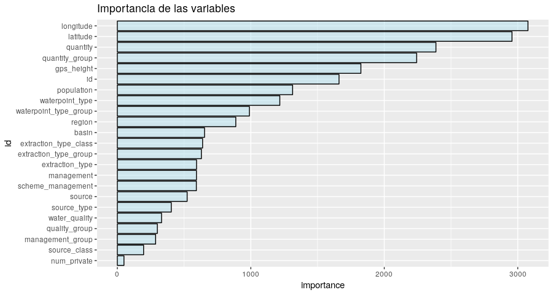
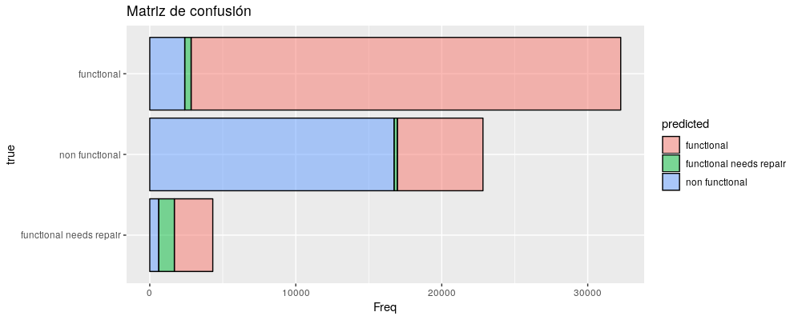
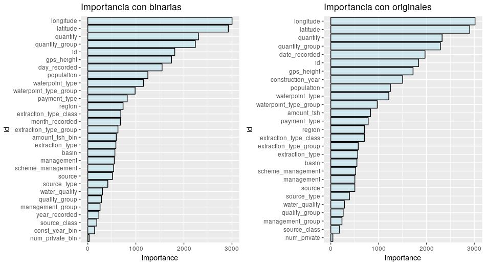
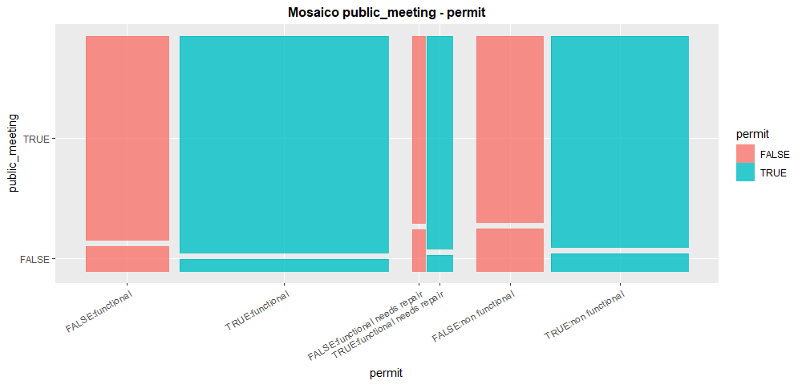
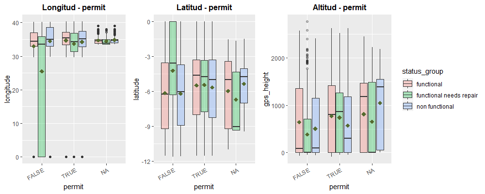
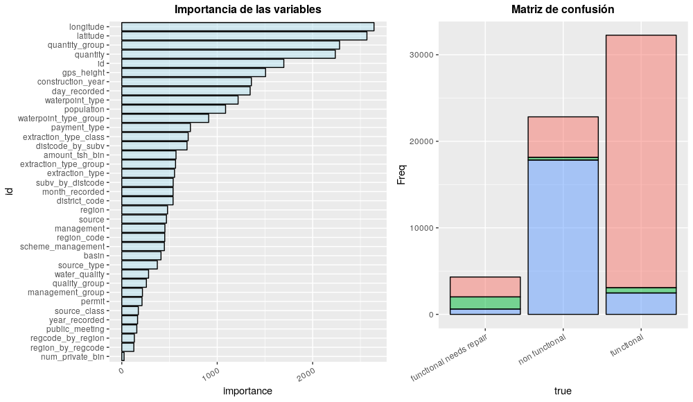
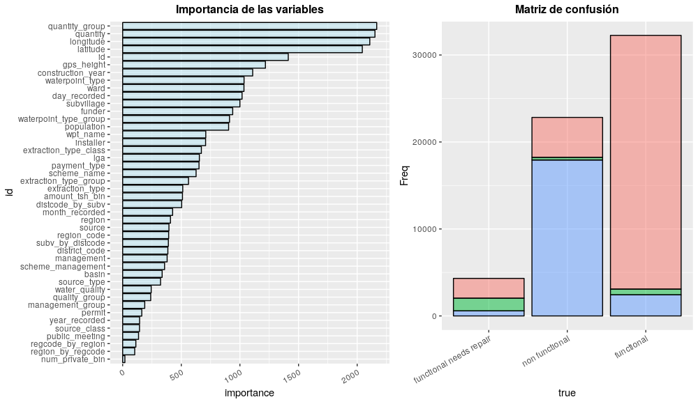
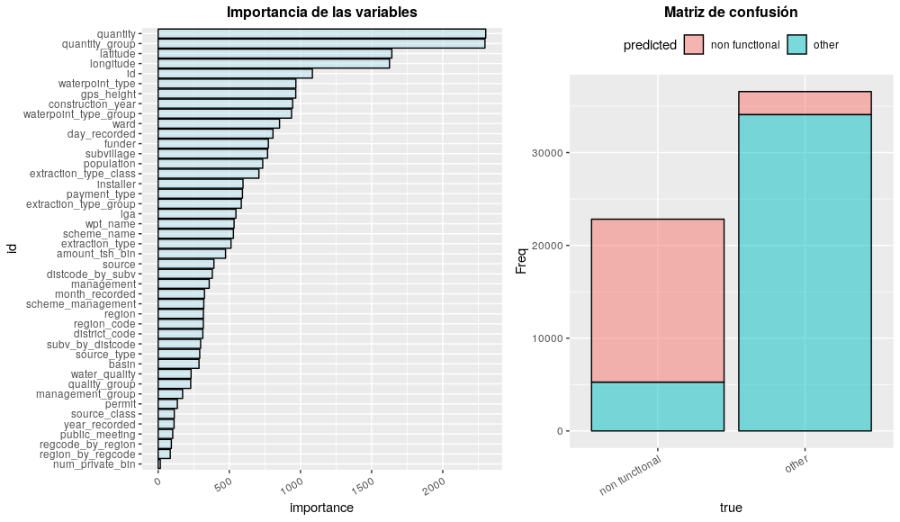
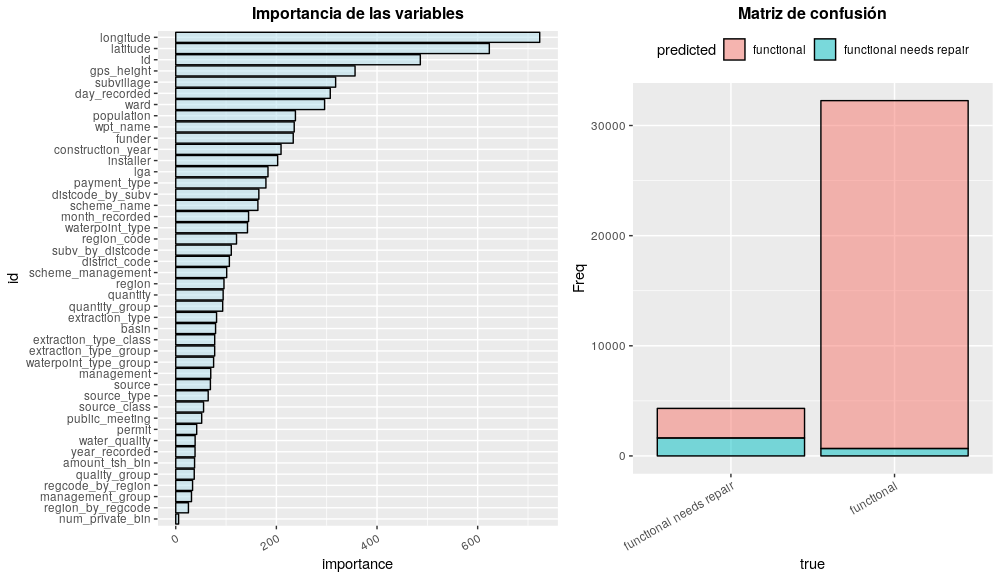

```{r setup, include=FALSE}
knitr::opts_chunk$set(echo = TRUE)
tarea <- function(ntot, nsel){
    dev<- c(rep("", nsel-1), "-", rep("", ntot-nsel))
    return(dev)
}
library(kableExtra)
```

# Introducción
En este domcumento se presenta nuestro periplo en la competición: [Pump it Up: Data Mining the Water Table](https://www.drivendata.org/competitions/7/pump-it-up-data-mining-the-water-table/).
Tratamos de participar en ella en grupo y mediante la metodología _Agile_, todo enfocado a simular el proceso de trabajo en una empresa dedicada al BigData. Más allá de los resultados lo interesante es ver como progresamos en la interiorización de la metodología.

# La competición
Se trata de una competición en la que se aportan múltiples datos de bombas de agua ubicadas en África cuya información procede de [Taarifa](http://taarifa.org/) que ha agregado información procedente del [Ministerio del Agua de Tanzania](http://maji.go.tz/). El objetivo es hacer un modelo de clasificación que las coloque en una de las 3 categorías posibles: funciona, funciona pero requiere mantenimiento y no funciona.

## Los datos
Disponemos de un _set_ de entrenamiento de 40 variables con 59400 observaciones, para estos datos conocemos su estado, mientras que tenemos 14850 bombas en el _set_ de test para las que no conocemos dicho estado.
La descripción de las variables es la siguiente:

+ `amount_tsh` - Cantidad de agua disponible para la bomba
+ `date_recorded` - La fecha en la que se grabo el dato
+ `funder` - Quien la financió
+ `gps_height` - Altitud
+ `installer` - Compañía que la instaló
+ `longitude` - Longitud (coordenadas GPS)
+ `latitude` - Latitud (coordenadas GPS)
+ `wpt_name` - Nombre de la bomba (si lo tiene)
+ `num_private` - **_Desconocido_**
+ `basin` - Cuenca geográfica
+ `subvillage` - Población geográfica
+ `region` - Región geográfica
+ `region_code` - Código de la región
+ `district_code` - Código del distrito
+ `lga` - Localización geográfica
+ `ward` - Localización greográfica
+ `population` - Población del entorno
+ `public_meeting` - Es de conocimiento público
+ `recorded_by` - Quién la registró
+ `scheme_management` - Quién la opera
+ `scheme_name` - Quién la opera
+ `permit` - Si se permite el acceso
+ `construction_year` - Año de construcción
+ `extraction_type` - Tipo de extracción
+ `extraction_type_group` - Tipo de extracción
+ `extraction_type_class` - Tipo de extracción
+ `management` - Como se gestiona
+ `management_group` - Como se gestiona
+ `payment` - Qué cuesta el agua
+ `payment_type` - Qué cuesta el agua
+ `water_quality` - Calidad del agua
+ `quality_group` - Calidad del agua
+ `quantity` - Cantidad de agua
+ `quantity_group` - Cantidad de agua
+ `source` - Fuente
+ `source_type` - Fuente
+ `source_class` - Fuente
+ `waterpoint_type` - Tipo de bomba
+ `waterpoint_type_group` - Tipo de bomba

Esta es la información que aporta la propia página sobre las variables, como vemos hay muchas descripciones repetidas, lo que es un claroindicador de que hay variables que contienen la misma información y hay muchas cuya descripción no resulta especialmente clarificadora.

## Los resultados
La mejor marca lograda en esta competición ha sido **82'22%** lo que nos sitúa por **encima del percentil 96** y la hemos logrado de la siguiente manera:

 * Eliminando ``recorded_by` porque solo presenta un valor y `payment` por ser redundante con `payment_type`.
 * Empleando las variables `amount_tsh` y `num_private` como binarias, en función de si valen 0 o no.
 * Extrayendo de `date_recorded` el, dia, el mes y el año, y usando la primera como numérica y las otras como categóricas.
 * Inputando los _missings_ de `public_meeting` y `permit` en base a los valores de `latitude` para esas observaciones, con cierto margen de aleatoriedad.
 * Incorporando las variables:
    + `regcode_by_region`: Número de `region_code` distintos por `region` (factor).
    + `region_by_regcode`: Número de `region` distintos por `region_code` (binaria).
    + `distcode_by_subv`: Número de `district_code` distintos por `subvillage` (factor).
    + `subv_by_distcode`: Número de `subvillage` diferentes por `district_code` (numérica).
* Reemplazando las variables categóricas con más de 25 categorías por sus frecuencias.
* Haciendo un modelo de _random forest_ que discriminase entre la categoría `non functional` y el resto, y luego otro que clasificase el resto.

## Para el futuro
En primer lugar convendría saber que tal se comporta un árbol sobre los datos tratados con `vtreat`.

La resolución del problema mediante dos clasificadores binarios abre las puertas a la prueba de múltiples algoritmos, incluso a combinaciones de algoritmos de distintas familias, ya que las variables relevantes para discriminar unos conjuntos de otros van cambiando.

No hemos incluido ninguna variable transformada (creo que `vtreat` tan solo ha incorporado _dummies_), este es todo un campo a explorar que según algunos compañeros puede dar lugar a grandes mejoras.

Hay muchos valores que son _missings_ disfrazados y que no se han explorado (los ceros de `longitude` y `latitude`, etc).

Sería interesante probar algún modelo de otra familia (regresión logística, *gradient boosting*, *support vector machines* o _naive_ bayes) y usar la librería `caret` para conrolar la variabilidad y el sesgo de nuestros modelos. 

# El proceso
Ahora voy a tratar de narrar el proceso de la forma más detallada posible, aunque posiblemente olvide alguna cosa. Si tu idea es profundizar en como logré la mejor marca, avanza hasta el [6º _sprint_.](#best)  
El esquema que hemos seguido se puede resumir en la siguiente imagen (*siendo las daily meetings hourly meetings*)

<center>

<figcaption>Esquema de trabajo Agile</figcaption>
</center>

## Backlog
Lo primero que hicimos fue elaborar un *Backlog* con las tareas que queríamos acometer, y repartirnoslas. Su aspecto inicial era el siguiente:
```{r, echo=FALSE}
tareas<- c("Análisis", "Conteo de valores",
           "Eliminación de missings", "Escalado", "Importacia variables",
           "Transformación", "Interacciones", "Variables nuevas",
           "Random Forest", "GBM", "SVM")

dt<- data.frame(row.names=tareas,
                Santi = tarea(length(tareas), 1),
                Javier = tarea(length(tareas), 3),
                Ester = tarea(length(tareas), 5),
                Bea = tarea(length(tareas), 4)
)
   
kable(dt,  align = "c") %>%
  kable_styling("striped", full_width = F) %>%
  pack_rows("Datos", 1, 8) %>%
    pack_rows("Modelos", 9, 11)
```

## Análisis de datos
Lo primero que hicimos fue extraer las características de los datos, separando las variables categóricas, las numéricas y las lógicas, luego procedimos a un análisis pormenorizado de cada una. Sobre las características generales de las variables nos quedo la siguiente tabla:
```{r eval=FALSE}
# 0. Libraries
library(data.table)
library(psych)
library(dplyr)

# 1. Load data ----
datTrain<- as.data.frame(fread("rawTrain.csv"))
datTest<- as.data.frame(fread("rawTest.csv"))
datTotal<- rbind(datTrain, datTest)
# Data dimension
dim(datTrain)
dim(datTest)
# Objective variable
datY<- as.data.frame(fread("rawTrain_y.csv"))

# 1.1 Data analysis ----
# Variable class
varDescription<- as.data.frame(sapply(datTotal, class))
colnames(varDescription)<- "clase"
varDescription$name<- row.names(varDescription)
row.names(varDescription)<- seq(1, nrow(varDescription))
varDescription$n_NANs<- sapply(datTotal, function(x) sum(is.na(x)))
varDescription<- varDescription[,c(2,1,3)]

# 1.1.1 Categoric variables ----
datTotal_cha<- datTotal[, varDescription$clase == 'character']
datTotal_cha<- as.data.frame(sapply(datTotal_cha, as.factor))
varFac<- names(datTotal_cha)
aux<- as.data.frame(t(datTotal_cha %>%
                          summarise_all(funs(n_distinct(.)))))
aux$name<- row.names(aux)
varDescription$n_CATs<- left_join(varDescription, aux)$V1

# 1.1.2 Numeric variables ----
datTotal_num<- datTotal[, varDescription$clase %in% c('numeric', 'integer')]
datTotal_num<- as.data.frame(sapply(datTotal_num, as.numeric))
varNum<- names(datTotal_num)
aux<- as.data.frame(psych::describe(datTotal_num))
aux$vars<- NULL
aux$n<- NULL
aux$name<- row.names(aux)
varDescription<- left_join(varDescription, aux)

# 1.1.3 Logical variables
datTotal_boo<- datTotal[, varDescription$clase %in% 'logical']
varBoo<- names(datTotal_boo)
# Stupid but useful columns
varDescription$is_Fac<- varDescription$name %in% varFac
varDescription$is_Num<- varDescription$name %in% varNum
varDescription$is_Boo<- varDescription$name %in% varBoo
varResume<- varDescription[order(varDescription$n_NANs, varDescription$clase),
                           c(1,2,3,4,5,7,10,11,6)]
treat<- c("amount_tsh", "date_recorded", "funder",
          "installer", "wpt_name", "subvillage", 
          "lga", "ward", "public_meeting", "recorded_by", 
          "scheme_name", "permit", "construction_year",
          "payment", "payment_type")
varResume$Tratamiento<- if_else(varResume$name %in% treat, "SI", "NO")
# 1.2 Save tipified data ----
datTotal<- cbind(datTotal_cha, datTotal_num, datTotal_boo)
datTotal$recorded_by<- NULL
saveRDS(datTotal, "./dat/datTotal")

# 1.3 Limpieza alto nivel ---
datZero<- datTotal[,varResume$name[varResume$Tratamiento=="NO"]]
saveRDS(datZero, "./dat/datZero")
```

```{r echo=FALSE, layout="body-outset"}
dt<- readRDS("./dat/varResume_0")
kable(dt,  align = "c", digits = c(2,2), row.names=FALSE) %>%
  kable_styling("striped", full_width = F) %>%
  pack_rows("Categóricas", 1, 28) %>%
    pack_rows("Numéricas", 29, 38) %>%
    pack_rows("Logicas / Binarias", 39, 40)
```

Así podemos ver de una forma bastante cómoda las categorías de las variables y sus características principales (número de _missing_, número de categorías, principales medidas de las numéricas y si requiere tratamiento). 
Para rellenar la columna `Tratamiento` hemos tomado en consideración únicamente si aparecían valores ilógicos, si presentaba demasiadas categorías, si hay patrones extraños y si presenta _missings_.
De esta forma hemos notado los siguientes aspectos a resaltar:

+ `amount_tsh`: Presenta un rango muy amplio para su media. 
+ `date_recorded`: Debe ser tratada como fecha, extrayendo la información relevante.
+ `gps_height`: Pesenta un mínimo negartivo, aunque podría ser válido, combiene cotejar.
+ `wpt_name`: 45684 categorías sin _missings_, posiblemente las bombas sin nombre sean cadenas de caracteres vacías.
+ `num_private`: Enteros centrados con media y mediana próximas a cero y un máximo de 1760. No obtenemos pistas de su significado.
+ `recorded_by`: Una única categoría, luego se puede eliminar.
+ `construction_year`: Contiene ceros, que probablemente debieran ser _missings_.
+ `payment` y `payment_type`: Presentan el mismo número de categorías, podrían ser redundantes.

## 1º _Sprint_ - H2O AutoML
Una vez tenemos una imagen descriptiva, aunque aún sea a escasa profundidad, del estado de los datos, lo primero que queremos es disponer de un modelo que nos sirve como _benchmark_, es decir, a partir del cual tratemos de mejorar nuestra capacidad predictiva.

Para definir este modelo lo primero que hemos hecho es seleccionar de los datos únicamente las variables que hemos encontrado que no requerían tratamiento y depués hemos usado la librería de _Machine Learning_ automático `h2o`, en su versión gratuita. A esta librería basta con alimentarla con un _set_ de datos, y tiempo, nosotros la hemos dejado 8000 segundos (~ 2 horas) y nos ha devuelto la siguiente tabla, en la que se muestran los algoritmos que ha probado y las métricas que ha ido obteniendo.
```{r eval=FALSE}
# 1. Load data ----
datZero<- readRDS("./dat/datZero")
datY<- as.data.frame(fread("./dat/rawTrain_y.csv"))
submiss<- as.data.frame(fread("./dat/SubmissionFormat.csv")) 
datTrain<- inner_join(datZero, datY)
datTest<- datZero[datZero$id %in% submiss$id,]
str(datTrain)
datTrain$status_group<- as.factor(datTrain$status_group)

# 2. Model ----
# H20 model to use as a bechmark
h2o.init(nthreads=-1)
train<- as.h2o(datTrain, destination_frame = "datTrain.hex")
y<- "status_group"
x<- colnames(datZero)

aml<- h2o.automl(x=x, y=y,
                 training_frame = train,
                 max_runtime_secs = 8000,
                 stopping_metric = "missclassification",
                 nfolds = 5,
                 exclude_algos = c('DeepLearning', 'StackedEnsemble'),
                 seed = 1)

# 2.1 Model metrics ----
lb <- aml@leaderboard
print(lb, n=nrow(lb))
# Save the model
saveRDS(aml, "./mod/h2o_base")

# 3. Prediction ----
mod<- readRDS("./mod/h2o_base")
test<- as.h2o(datTest, destination_frame = "datTest.hex")
predicted<- as.data.frame(h2o.predict(mod@leader, test))
pred<- data.frame(id=datTest$id,
                  status_group = predicted$predict)
# Write submission
fwrite(pred, "./sub/V01_h2o_base")
```

```{r echo=FALSE}
library(data.table)
dt<- as.data.frame(fread("./dat/h2oLB.csv"))
kable(dt,  align = "c", digits = c(2,2), row.names=FALSE) %>%
  kable_styling("striped", full_width = F)
```

Como podemos ver no hay mucha variedad, los algoritmos ganadores son prácticamente todos modelos de *Gradient Boosting*, salvo algunos casos de _Random Forest_.

En general estos son los modelos que, ya nos han contado, suelen ganar en [Kaggle](https://www.kaggle.com/) así que tampoco nos sorprende. Lo siguiente que haremos será establecer la precisión sobre el _set_ de test de este modelo como punto de partida, y a partir de ella trata de mejorar.

<center>

<figcaption>Puntuación modelo H2O</figcaption>
</center>
<br>
La puntuación obtenida resultó ser: **_78'02%_**, la cual es más que aceptable para el esfuerzo realizado. Ahora bien, si el día de mañana queremos ganarnos el pan tenemos que mejorarla.

## 2º _Sprint_ - _Random Forest_
Aún en este _sprint_ vamos a dejar los datos como los tenemos, y vamos a probar un modelo de _random forest_ realizado con la librería `ranger`. Sabemos de otras librerías a nuestra disposición, pero `ranger` se impone por su velocidad y facilidad de uso. Como de momento no vamos a manipular los datos el código es esencialmente idéntico.
```{r eval=FALSE}
# 1. Load data ----
datZero<- readRDS("./dat/datZero")
datY<- as.data.frame(fread("./dat/rawTrain_y.csv"))
submiss<- as.data.frame(fread("./dat/SubmissionFormat.csv")) 
datTrain<- inner_join(datZero, datY)
datTest<- datZero[datZero$id %in% submiss$id,]
datTrain$status_group<- as.factor(datTrain$status_group)

# 2. Model ----
frml<- as.formula(paste("status_group ~", paste(names(datZero), collapse="+")))

set.seed(1234)
my_mod<- ranger(frml,
                data = datTrain,
                importance = "impurity")

# 2.1 Model Metrics
# Importancia de las variables
aux<- as.data.frame(my_mod$variable.importance)
aux$id<- rownames(aux)
rownames(aux)<- seq(1, nrow(aux))
aux$importance<- aux[,1]
aux[,1]<- NULL
ggplot(data=aux, aes(x=id, y=importance))+
    geom_bar(stat="identity", color="black", fill="lightblue2", show.legend = FALSE, alpha=0.5) +
    scale_x_discrete(limits=aux$id[order(aux$importance)]) +
    coord_flip() + ggtitle("Importancia de las variables")
# Matriz de confusión
aux<- as.data.frame(my_mod$confusion.matrix)
ggplot(data=aux, aes(x=predicted, y=Freq, fill=true))+
    geom_bar(stat="identity", color="black", show.legend = TRUE, alpha=0.5) +
    scale_x_discrete(limits=unique(aux$predicted[order(aux$Freq)])) +
    coord_flip() + ggtitle("Matriz de confusion")
# Error en la predicción
my_mod$prediction.error

# Save the model
saveRDS(my_mod, "./mod/V02_ranger")

# 3. Prediction ----
mod<- readRDS("./mod/V02_ranger")
predicted<- predict(mod, datTest)
pred<- data.frame(id=datTest$id,
                  status_group = predicted$predictions)
# Write submission
fwrite(pred, "./sub/V02_ranger_base")
```

Con este modelo ya aprovechamos para investigar algunas cosas importantes. Lo primero era incorporar las variables, al menos aquellas que incorporásemos al modelo, al consultar esta información pudimos ver lo siguiente:
<center>

</center>
<br>

En el gráfico de las variables notamos en primer lugar la relevancia de las variables de localización, incluida la altitud, y llamaba la atención también el bajo lugar que ocupaban la calidad del agua o la fuente. Como esperábamos la población o y la región tienen una significación elevada, mientras que `num_private` presenta una relevancia ínfima, en cualquier entorno de producción y dado que desconocemos su origen y su significado, lo lógico sería deshacernos directamente de ella.

Por otro lado, vimos, y nos va a servir para mostrar cómo de balanceadas están nuestras clases, la matriz de confusión del modelo de la siguiente forma:
<center>

</center>
<br>

Lo interesante de ver la matriz de confusión así es que puedes ver, además de cuantas observaciones hay por cada clase objetivo, lo que es clave para el desarrollo de modelos, que clases está confundiendo entre sí. Podemos ver como claramente le resulta algo más dificil (contra todo pronóstico) diferenciar `functional` que `non functional` de `functional needs repair`. Esto nos dió la idea de probar a agrupar las clases, y hacer dos modelos de clasificación binaria, lo que fue a parar al _backlog_.

Finalmente, como no podía ser de otra forma, subimos las predicciones y obtuvimos:
<center>

<figcaption>Puntuación ranger base</figcaption>
</center>
<br>

Un _**80'33%**_ lo que mejora el resultado del modelo anterior y nos permite pensar que al AutoML le queda camino por recorrer, ya que nosotros no hemos aún tocado los datos.

## 3º _Sprint_ - Resolviendo sospechas
Llegado este punto le echamos un ojo a las variables para ver cuales de nuestras sospechas eran ciertas. Lo que hemos observado es que efectivamente `payment` y `payment_type` contenían las mismas categorías, así que he eliminado una de ellas. `construction_year` presenta 55 valores, muy polarizados, siendo más o menos el 30% de sus valores ceros, teniendo muchos agrupados en torno a los 2000 pero también algunos en medio, así que he probado a generar una variable ternaria que vale 0 si `construction_year` es 0, 1 si es menor que 1800, y 2 en el resto de casos. Lo mismo ocurre con `num_private` y `amount_tsh` pero de forma más acusada (98% y 70% respectivamente) así que he procedido a generar binarias. He estudiado `wpt_name` pero sin llegar a ninguna conclusión en positivo ya que apenas el 5% de los datos valen `none` y finalmente de `date_recorded` he extraido el año y el mes como factores y el día como numérica. Con estas variables, incorporando en un caso las originales y en el otro las derivadas, voy a hacer nuevos árboles y en función de la importancia de las variables elegimos qué nos quedamos.
```{r eval=FALSE}
# 0. Libraries
library(data.table)
library(dplyr)
library(ranger)
library(ggplot2)
library(gridExtra)
source("funciones.R")

# 1. Load data ----
datTotal<- readRDS("./dat/datTotal")
datY<- as.data.frame(fread("./dat/rawTrain_y.csv"))
submiss<- as.data.frame(fread("./dat/SubmissionFormat.csv")) 
datTrain<- inner_join(datTotal, datY)
datTest<- datTotal[datTotal$id %in% submiss$id,]
datTrain$status_group<- as.factor(datTrain$status_group)

# 1.1 Solve our questions ----
# Have payment and pyment_tupe the same info?
aux<- as.data.frame(datTotal %>%
                  group_by(payment_type) %>% 
                  summarise(count = n_distinct(payment))
)
saveRDS(aux, "./dat/payment")
datTotal$payment<- NULL

# How is construction_year distributed?
length(unique(datTotal$construction_year)) # SOlo 55
length(datTotal$construction_year[datTotal$construction_year == 0]) # 1/3 son 0
myDistPlot(datTrain, "construction_year", "status_group", "construction_year - Dist")
datTotal$const_year_bin<- as.factor(ifelse(datTotal$construction_year ==0, 0,
                                           ifelse(datTotal$construction_year<1800, 1, 2)))

# How is num_private distributed?
length(unique(datTotal$num_private)) # SOlo 68
length(datTotal$num_private[datTotal$num_private == 0]) # 98,7% son 0
datTotal$num_private_bin<- as.factor(ifelse(datTotal$num_private == 0, 0, 1))

# What is wpt_name behaviour?
length(datTotal$wpt_name[datTotal$wpt_name == "none"]) # 5'98% son none
# Ni idea de qué hacer

# How is amount_tsh distributed?
length(unique(datTotal$amount_tsh)) # Solo 102
length(datTotal$amount_tsh[datTotal$amount_tsh == 0]) # 70,1% son 0
datTotal$amount_tsh_bin<- as.factor(ifelse(datTotal$amount_tsh == 0, 0, 1))

# Extract date info from date_recorded
datTotal$year_recorded <- as.factor(format(as.Date(datTotal$date_recorded), "%Y"))
datTotal$month_recorded <- as.factor(format(as.Date(datTotal$date_recorded), "%m"))
datTotal$day_recorded <- as.numeric(format(as.Date(datTotal$date_recorded), "%d"))

# 1.2 Update varResume ----
# Variable class
varDescription<- as.data.frame(sapply(datTotal, class))
colnames(varDescription)<- "clase"
varDescription$name<- row.names(varDescription)
varDescription$clase<- as.character(varDescription$clase)
row.names(varDescription)<- seq(1, nrow(varDescription))
varDescription$n_NANs<- sapply(datTotal, function(x) sum(is.na(x)))
varDescription<- varDescription[,c(2,1,3)]

# 1.2.1 Categoric variables ----
datTotal_cha<- datTotal[, varDescription$clase == "factor"]
datTotal_cha<- as.data.frame(sapply(datTotal_cha, as.factor))
varFac<- names(datTotal_cha)
aux<- as.data.frame(t(datTotal_cha %>%
                          summarise_all(funs(n_distinct(.)))))
aux$name<- row.names(aux)
varDescription$n_CATs<- left_join(varDescription, aux)$V1

# 1.2.2 Numeric variables ----
datTotal_num<- datTotal[, varDescription$clase %in% c('numeric', 'integer')]
datTotal_num<- as.data.frame(sapply(datTotal_num, as.numeric))
varNum<- names(datTotal_num)
aux<- as.data.frame(psych::describe(datTotal_num))
aux$vars<- NULL
aux$n<- NULL
aux$name<- row.names(aux)
varDescription<- left_join(varDescription, aux)

# 1.2.3 Logical variables
datTotal_boo<- datTotal[, varDescription$clase %in% 'logical']
varBoo<- names(datTotal_boo)

varResume<- varDescription[order(varDescription$n_NANs, varDescription$clase),
                           c(1,2,3,4,5,7,10,11,6)]
treat<- c("funder", "wpt_name",
          "installer", "subvillage",
          "region_code", "district_code",
          "lga", "ward", "public_meeting",
          "scheme_name", "permit")
varResume$Tratamiento<- if_else(varResume$name %in% treat, "SI", "NO")
saveRDS(varResume, "./dat/varResume")

# 1.3 New datasets ----
datNow<- datTotal[,varResume$name[varResume$Tratamiento=="NO"]]
datOne_sin<- datNow[,!(names(datNow) %in% c("construction_year", "date_recorded", "num_private",
                                            "amount_tsh"))]
datOne_con<- datNow[,!(names(datNow) %in% c("const_year_bin", "num_private_bin", "amount_tsh_bin",
                                            "year_recorded", "month_recorded", "day_recorded"))]

# 2. Models ----
datOne<- datOne_con
frml<- as.formula(paste("status_group ~", paste(names(datOne), collapse="+")))
datTrain<- inner_join(datOne, datY)
datTrain$status_group<- as.factor(datTrain$status_group)
datTest<- datOne[datOne$id %in% submiss$id,]
set.seed(1234)
my_mod_con<- ranger(frml,
                    data = datTrain,
                    importance = "impurity")

datOne<- datOne_sin
frml<- as.formula(paste("status_group ~", paste(names(datOne), collapse="+")))
datTrain<- inner_join(datOne, datY)
datTrain$status_group<- as.factor(datTrain$status_group)
datTest<- datOne[datOne$id %in% submiss$id,]
set.seed(1234)
my_mod_sin<- ranger(frml,
                    data = datTrain,
                    importance = "impurity")

# 2.1 Model Comparison ---- 
# Importancia de las variables
aux<- as.data.frame(my_mod_con$variable.importance)
aux$id<- rownames(aux)
rownames(aux)<- seq(1, nrow(aux))
aux$importance<- aux[,1]
aux[,1]<- NULL
p_con<- ggplot(data=aux, aes(x=id, y=importance))+
    geom_bar(stat="identity", color="black", fill="lightblue2", show.legend = FALSE, alpha=0.5) +
    scale_x_discrete(limits=aux$id[order(aux$importance)]) +
    coord_flip() + ggtitle("Importancia con originales")
aux<- as.data.frame(my_mod_sin$variable.importance)
aux$id<- rownames(aux)
rownames(aux)<- seq(1, nrow(aux))
aux$importance<- aux[,1]
aux[,1]<- NULL
p_sin<- ggplot(data=aux, aes(x=id, y=importance))+
    geom_bar(stat="identity", color="black", fill="lightblue2", show.legend = FALSE, alpha=0.5) +
    scale_x_discrete(limits=aux$id[order(aux$importance)]) +
    coord_flip() + ggtitle("Importancia con binarias")

grid.arrange(p_sin, p_con, ncol=2)
```

<center>

</center>
<br>

A la vista de los gráficos creo que tiene sentido aplicar las transformaciones para `date_recorded`, `amount_tsh` y `num_private`, `construction_year` creo que la voy a incorporar como numérica ya que parece que así aporta mayor información. De acuerdo a estas decisiones elaboramos un último modelo para realizar las predicciones.

```{r eval=FALSE}
# 2.2 Final Data ----
datOne<- datNow[,!(names(datOne) %in% c("const_year_bin", "num_private", "amount_tsh",
                                        "date_recorded"))]
saveRDS(datOne, "./dat/datOne")

# 2. Final Model ----
frml<- as.formula(paste("status_group ~", paste(names(datOne), collapse="+")))
datTrain<- inner_join(datOne, datY)
datTrain$status_group<- as.factor(datTrain$status_group)
datTest<- datOne[datOne$id %in% submiss$id,]
set.seed(1234)
my_mod<- ranger(frml,
                data = datTrain,
                importance = "impurity")

# Matriz de confusión
aux<- as.data.frame(my_mod$confusion.matrix)
ggplot(data=aux, aes(x=true, y=Freq, fill=predicted))+
    geom_bar(stat="identity", color="black", show.legend = TRUE, alpha=0.5) +
    scale_x_discrete(limits=unique(aux$predicted[order(aux$Freq)])) +
    coord_flip() + ggtitle("Matriz de confusion")

# Error en la predicción
my_mod$prediction.error

# Save the model
saveRDS(my_mod, "./mod/V03_ranger")

# 3. Prediction ----
mod<- readRDS("./mod/V03_ranger")
predicted<- predict(mod, datTest)
pred<- data.frame(id=datTest$id,
                  status_group = predicted$predictions)
# Write submission
fwrite(pred, "./sub/V03_ranger_one")
```

Con estos datos en los que incorporo la información de en torno al 75% de las variables, he obtenido una puntuación de _**81'89%**_ como muestra la imagen. Avanzamos consistentemente.
<center>

<figcaption>Puntuación ranger primeras transformaciones</figcaption>
</center>
<br>

## 4º _Sprint_ - Inputación de missings
A estas alturas nuestro conocimiento de las variables, presenta el siguiente aspecto:
```{r echo=FALSE, layout="body-outset"}
dt<- readRDS("./dat/varResume_1")
kable(dt,  align = "c", digits = c(2,2), row.names=FALSE) %>%
  kable_styling("striped", full_width = F) %>%
  pack_rows("Categóricas", 1, 31) %>%
    pack_rows("Numéricas", 32, 42) %>%
    pack_rows("Logicas / Binarias", 42, 44)
```

Y el plan en este _sprint_ es incorporar las variables binarias y las 2 numéricas que quedan por incorporar, para así dejar únicamente fuera del modelo las variables categóricas con muchas categorías, las cuales trataremos más adelante.

Como las variables lógicas son las únicas que incorporan datos _missing_ empezaremos por esto, y depués nos encargaremos de las numéricas. Lo primero es ver como se reparten las categorías objetivo entre las opciones de las variables:
```{r eval=FALSE}
# 1. Load data ----
datTotal<- readRDS("./dat/datTotal")
datY<- as.data.frame(fread("./dat/rawTrain_y.csv"))
submiss<- as.data.frame(fread("./dat/SubmissionFormat.csv")) 
datTrain<- inner_join(datTotal, datY)
datTrain$status_group<- as.factor(datTrain$status_group)
datTest<- datTotal[datTotal$id %in% submiss$id,]

# 2.1 Watching logic vars distribution
aux<- datTrain[,c("public_meeting", "permit", "status_group")]
ggplot(data=aux)+
    geom_mosaic(aes(x=product(public_meeting, permit, status_group), fill=permit),
                na.rm=TRUE, offset = 0.04, divider=ddecker()) +
    theme_update(plot.title = element_text(size = 12, face = "bold", hjust = 0.5),
                 axis.text.x = element_text(angle = 30, hjust = 1)) +
    ggtitle("Mosaico public_meeting - permit") + 
    xlab("permit") +
    ylab("public_meeting")

print(aux %>%
          group_by(status_group, permit, public_meeting) %>%
          summarise(N = n()) %>% 
          mutate(freq = N / sum(N)),
      n=27)

print(aux %>%
          group_by(status_group, public_meeting, permit) %>%
          summarise(N = n()) %>% 
          mutate(freq = N / sum(N)),
      n=27)
print(aux %>%
          group_by(public_meeting, permit) %>%
          summarise(N = n()) %>% 
          mutate(freq = N / sum(N)))
```
<center>

</center>
<br>

Vemos que el reparto en `public_meeting` difiere muy poco, 7% de observaciones son `functional` son `r FALSE` y un 88% `r TRUE`, para `functional needs repair` la relación es 10% - 86% y para `non functional` 11% - 82%. Para `permit` tampoco hay grandes diferencias, en `functional` 28% - 67%, en `functional needs repair` 30% - 63% y en `non functional` 31% - 64% (las relaciones siempre son `r FALSE` - `r TRUE`); el resto son _missings_. 

Para inputar los valores _missings_ hemos usado un procedimiento de cierta complejidad, así que lo explico únicamente para `permit` ya que para `public_meeting` lo repetimos. Primero vimos como se distribuían las variables numéricas más relevantes con respecto a 
la variable que queremos inputar, obteniendo gráficos del siguiente estilo:
```{r eval=FALSE}
# Input missing values
p1<- myBoxPlot(datTrain, "permit", "longitude", "status_group", "Longitud - permit", FALSE)
p2<- myBoxPlot(datTrain, "permit", "latitude", "status_group", "Latitud - permit", FALSE)
p3<- myBoxPlot(datTrain, "permit", "gps_height", "status_group", "Altitud - permit", TRUE)
grid.arrange(p1, p2, p3, ncol=3, widths=c(1,1,1.75))
datTotal<- fillMissCat(datTotal, "permit", "latitude", 15)

p1<- myBoxPlot(datTrain, "public_meeting", "longitude", "status_group", "Longitud - public_meeting",
               FALSE)
p2<- myBoxPlot(datTrain, "public_meeting", "latitude", "status_group", "Latitud - public_meeting",
               FALSE)
p3<- myBoxPlot(datTrain, "public_meeting", "gps_height", "status_group", "Altitud - public_meeting",
               TRUE)
grid.arrange(p1, p2, p3, ncol=3, widths=c(1,1,1.75))
datTotal<- fillMissCat(datTotal, "public_meeting", "latitude", 15)
summary(datTotal)
```
<center>

</center>
<br>

Hemos mirado cual de ellas es la que parece discriminar mejor las categorías `r TRUE` y `r FALSE` conservando información de la variable objetivo. Hemos generado una función que divide esta variable numérica en `n` grupos (haciendo cortes) y para cada grupo calcula la frecuencia acumulada de categorías, calcula el grupo al que pertenece cada valor _missing_ en los datos y le asigna un valor aleatorio (uniforme entre 0 y 1), finalmente reemplaza el missing por el valor que correspondería a una frecuencia representada por el aleatorio dentro del grupo. De esta forma se conserva la distribución de categorías y se asocia a cada dato _missing_ un valor similar al de las observaciones con valores de la variable numérica similares.

En nuestro caso hemos usado para inputar tanto en `permit` como en `public_meeting` la variable `latitude` y hemos visto que las frecuencias relativas de verdaderos y falsos se conservaban. 

Ahora vamos a ocuparnos de las últimas dos variables numéricas que no hemos incorporado y que son `region_code` y `district_code` primero miramos si `region` y `region_code` contienen la misma información y descrubrimos que es prácticamente la misma, únicamente unas pocas regiones como *Arusha*, *Lindi*, *Mtwara* y otras 4 contienen 2 o 3 `region_code` diferentes. Si hacemos lo mismo para `region_code` encontramos 6 códigos repetidos. Voy a incorporar `region_code` al modelo como está y dependiendo de como quede en cuanto a relevancia con respecto a `region` tomaremos una decisión.
```{r eval=FALSE}
# What to do with numeric variables
# region_code
print(datTotal %>%
          group_by(region) %>% 
          summarise(count = n_distinct(region_code)) %>%
          filter(count > 1),
      n=21)

print(datTotal %>%
          group_by(region_code) %>% 
          summarise(count = n_distinct(region)) %>% 
          filter(count > 1),
      n=27)
# district_code
print(datTotal %>%
          group_by(subvillage) %>% 
          summarise(count = n_distinct(district_code)) %>% 
          filter(count > 1),
      n=27)

print(datTotal %>%
          group_by(district_code) %>% 
          summarise(count = n_distinct(subvillage)) %>% 
          filter(count > 1),
      n=27)

# 2.3 Add new variables ----
# Códigos por región - factor
code_by_region<- as.data.frame(datTotal %>%
                                   group_by(region) %>% 
                                   summarise(count = n_distinct(region_code))
)
datTotal$regcode_by_region<- as.factor(
    code_by_region$count[match(datTotal$region,code_by_region$region)]
)
# Regiones por código - factor
region_by_code<- as.data.frame(datTotal %>%
                                   group_by(region_code) %>% 
                                   summarise(count = n_distinct(region))
)
datTotal$region_by_regcode<- as.factor(
    ifelse(
        region_by_code$count[match(datTotal$region_code, region_by_code$region_code)] < 2,
        0,1
    )
)
# Distritos por pueblo - factor
code_by_subv<- as.data.frame(datTotal %>%
                                 group_by(subvillage) %>% 
                                 summarise(count = n_distinct(district_code))
)
datTotal$distcode_by_subv<- as.factor(
    code_by_subv$count[match(datTotal$subvillage,code_by_subv$subvillage)]
)
# Pueblos por distrito - numérica
subv_by_code<- as.data.frame(datTotal %>%
                                 group_by(district_code) %>% 
                                 summarise(count = n_distinct(subvillage))
)
datTotal$subv_by_distcode<- subv_by_code$count[
    match(datTotal$district_code,subv_by_code$district_code)
    ]
```

Para la variable `district_code` vamos a ver si está relacionada con `subvillage`. Hemos encontrado que el número de `district_code` por `subvillage` no es elevado (no es raro, hay muchísimas `subvillage`), sin embargo, al tratar de hacerlo al revés hemos encontrado el número de `subvillage` por `district_code` si es elevado. Esto ha despertado la idea de incorporar estas 4 nuevas variables, 3 de ellas como factores:

* `regcode_by_region`: Número de `region_code` distintos por `region` (factor).
* `region_by_regcode`: Número de `region` distintos por `region_code` (binaria).
* `distcode_by_subv`: Número de `district_code` distintos por `subvillage` (factor).
* `subv_by_distcode`: Número de `subvillage` diferentes por `district_code` (numérica).

Tras todo este proceso podemos ver como queda nuestra tabla de variables:
```{r echo=FALSE, layout="body-outset"}
dt<- readRDS("./dat/varResume_2")
kable(dt,  align = "c", digits = c(2,2), row.names=FALSE) %>%
  kable_styling("striped", full_width = F) %>%
  pack_rows("Categóricas", 1, 34) %>%
    pack_rows("Numéricas", 35, 44)
```

Ya solo nos quedan por tratar las variables que presentan categorías en exceso. No podemos eludir que no hemos tratado los falsos _missing_, que hay en variables como las geográficas, que presentan multitud de ceros, y muchas otras, cuyas distribuciones hacen pensar que ocurre cosa similar. No obstante estamos en una simulación de **_Agile_** con _sprints_ cortos, y a ese nivel de análisis probablemente no lleguemos (al fin y al cabo esto han sido 10 horas, más alguna otra que le hemos echado en casa (algunas muchas)). Dicho esto, como ya viene siendo costumbre, incorporamos todas las variables marcadas como que no requieren tratamiento y procedemos a hacer un modelo.

Es interesante mirar como quedan dispuestas por importancia las variables, para cotejar que las nuevas que hemos creado no son inútiles, y efectivamente las que relacionan el código de distrito con `subvillage` se sitúan en la zona central de la tabla, sin embargo, las que relacionan `region` y `region_code` aparecen a la cola, no obstante, como mejoran bastante con respecto a la importancia de `num_private`, las vamos a dejar. 
```{r eval=FALSE}
# 1.3 New datasets ----
datTwo<- datTotal[,varResume$name[varResume$Tratamiento=="NO"]]

# 3. Models ----
frml<- as.formula(paste("status_group ~", paste(names(datTwo), collapse="+")))
datTrain<- inner_join(datTwo, datY)
datTrain$status_group<- as.factor(datTrain$status_group)
datTest<- datTwo[datTwo$id %in% submiss$id,]
set.seed(1234)
my_mod<- ranger(frml,
                data = datTrain,
                importance = "impurity")
# Importancia de las variables
aux<- as.data.frame(my_mod$variable.importance)
aux$id<- rownames(aux)
rownames(aux)<- seq(1, nrow(aux))
aux$importance<- aux[,1]
aux[,1]<- NULL
impo<- ggplot(data=aux, aes(x=id, y=importance))+
    geom_bar(stat="identity", color="black", fill="lightblue2", show.legend = FALSE, alpha=0.5) +
    scale_x_discrete(limits=aux$id[order(aux$importance)]) +
    coord_flip() + ggtitle("Importancia de las variables")

# Matriz de confusión
aux<- as.data.frame(my_mod$confusion.matrix)
conf<- ggplot(data=aux, aes(x=true, y=Freq, fill=predicted))+
    geom_bar(stat="identity", color="black", show.legend = FALSE, alpha=0.5) +
    scale_x_discrete(limits=unique(aux$predicted[order(aux$Freq)])) +
    ggtitle("Matriz de confusion")

grid.arrange(impo, conf, ncol=2, widths=c(1.3, 1))

# Error en la predicción
my_mod$prediction.error

# Save the model
saveRDS(my_mod, "./mod/V04_ranger")

# 3. Prediction ----
mod<- readRDS("./mod/V04_ranger")
predicted<- predict(mod, datTest)
pred<- data.frame(id=datTest$id,
                  status_group = predicted$predictions)
# Write submission
fwrite(pred, "./sub/V04_ranger_one.csv")
```
<center>

</center>
<br>

A la vista de la matriz de confusión y del promedio de error en las predicciones, no he visto mejoras sustanciales con respecto al modelo anterior, hacemos la _submission_ pertinente y nos encontramos:
<center>

<figcaption>Puntuación ranger medio</figcaption>
</center>
<br>

Un _**81'74%**_ como temíamos estamos rebotando contra el techo del 82%.

## 5º Sprint - Categoría por frecuencia
En este sprint únicamente reemplazamos las variables categóricas con exceso de categorías por sus frecuencias y procedimos a la predicción. Se trata del primer modelo que incorpora todas las variables, y solo por el placer de verlo vamos a mostrar una última vez la tabla con las características de las variables, tal y como ha quedado a partir de ahora:
```{r eval=FALSE}
# 0. Libraries
library(data.table)
library(dplyr)
library(ranger)
library(ggplot2)
library(ggmosaic)
library(gridExtra)
source("funciones.R")

# 1. Load data ----
datTotal<- readRDS("./dat/datTotal_2")
datY<- as.data.frame(fread("./dat/rawTrain_y.csv"))
submiss<- as.data.frame(fread("./dat/SubmissionFormat.csv")) 
datTrain<- inner_join(datTotal, datY)
datTrain$status_group<- as.factor(datTrain$status_group)
datTest<- datTotal[datTotal$id %in% submiss$id,]

# 2. Replace factors with too much levels for it's absolute frequency ----
varResume<- readRDS("./dat/varResume_2")
treat_cols<- varResume$name[varResume$Tratamiento=="SI"]
for(col in treat_cols){
    cat_count<- as.data.frame(datTotal %>%
                                  group_by(!!sym(col)) %>% 
                                  summarise(count = n_distinct(id))
    )
    datTotal[[col]]<- as.numeric(cat_count$count[match(datTotal[[col]],cat_count[[col]])])    
}

# 2.1 Update varResume ----
# Variable class
varDescription<- as.data.frame(sapply(datTotal, class))
colnames(varDescription)<- "clase"
varDescription$name<- row.names(varDescription)
varDescription$clase<- as.character(varDescription$clase)
row.names(varDescription)<- seq(1, nrow(varDescription))
varDescription$n_NANs<- sapply(datTotal, function(x) sum(is.na(x)))
varDescription<- varDescription[,c(2,1,3)]

# 2.1.1 Categoric variables ----
datTotal_cha<- datTotal[, varDescription$clase == "factor"]
datTotal_cha<- as.data.frame(sapply(datTotal_cha, as.factor))
varFac<- names(datTotal_cha)
aux<- as.data.frame(t(datTotal_cha %>%
                          summarise_all(funs(n_distinct(.)))))
aux$name<- row.names(aux)
varDescription$n_CATs<- left_join(varDescription, aux)$V1

# 2.1.2 Numeric variables ----
datTotal_num<- datTotal[, varDescription$clase %in% c('numeric', 'integer')]
datTotal_num<- as.data.frame(sapply(datTotal_num, as.numeric))
varNum<- names(datTotal_num)
aux<- as.data.frame(psych::describe(datTotal_num))
aux$vars<- NULL
aux$n<- NULL
aux$name<- row.names(aux)
varDescription<- left_join(varDescription, aux)

# 2.1.3 Variables Resume ----
varResume<- varDescription[order(varDescription$n_CATs, decreasing=T),c(1,2,3,4,5,7,10,11,6)]
treat<- c()
varResume$Tratamiento<- if_else(varResume$name %in% treat, "SI", "NO")
saveRDS(varResume, "./dat/varResume_3")
saveRDS(datTotal, "./dat/datTotal_3")
```

```{r echo=FALSE, layout="body-outset"}
dt<- readRDS("./dat/varResume_3")
kable(dt,  align = "c", digits = c(2,2), row.names=FALSE) %>%
  kable_styling("striped", full_width = F) %>%
  pack_rows("Categóricas", 1, 34) %>%
    pack_rows("Numéricas", 35, 44)
```

Ya vemos que ha crecido el set de numéricas, con las 7 que quedaban por tratar en la tabla anterior. Tocaba ya realizar un modelo con el set completo y este ha sido el momento, el código  y las métricas han sido las siguientes:
```{r eval=FALSE}
# 3. Models ----
frml<- as.formula(paste("status_group ~", paste(names(datTotal), collapse="+")))
datTrain<- inner_join(datTotal, datY)
datTrain$status_group<- as.factor(datTrain$status_group)
datTest<- datTotal[datTotal$id %in% submiss$id,]
set.seed(1234)
my_mod<- ranger(frml,
                data = datTrain,
                importance = "impurity")
# Importancia de las variables
aux<- as.data.frame(my_mod$variable.importance)
aux$id<- rownames(aux)
rownames(aux)<- seq(1, nrow(aux))
aux$importance<- aux[,1]
aux[,1]<- NULL
impo<- ggplot(data=aux, aes(x=id, y=importance))+
    geom_bar(stat="identity", color="black", fill="lightblue2", show.legend = FALSE, alpha=0.5) +
    scale_x_discrete(limits=aux$id[order(aux$importance)]) +
    coord_flip() + ggtitle("Importancia de las variables")

# Matriz de confusión
aux<- as.data.frame(my_mod$confusion.matrix)
conf<- ggplot(data=aux, aes(x=true, y=Freq, fill=predicted))+
    geom_bar(stat="identity", color="black", show.legend = FALSE, alpha=0.5) +
    scale_x_discrete(limits=unique(aux$predicted[order(aux$Freq)])) +
    ggtitle("Matriz de confusion")

grid.arrange(impo, conf, ncol=2, widths=c(1.3, 1))

# Error en la predicción
my_mod$prediction.error

# Save the model
saveRDS(my_mod, "./mod/V05_ranger")

# 3. Prediction ----
mod<- readRDS("./mod/V05_ranger")
predicted<- predict(mod, datTest)
pred<- data.frame(id=datTest$id,
                  status_group = predicted$predictions)
# Write submission
fwrite(pred, "./sub/V05_ranger_three.csv")
```
<center>

</center>
<br>

A la vista de la importancia de las variables hay hueco para la ilusión ya que 2 de las nuevas variables se sitúan a la cabeza mientras que varias aparecen también en la parte superior. Hora de subir las predicciones con cierta emoción y:
<center>

<figcaption>Puntuación ranger avanzado</figcaption>
</center>
<br>

¡Hemos roto el techo del 82%!, _**82'11%**_ parece una nota aceptable pero como dijo aquel: "lo peor será que cuando llegues querrás saber que hay más allá". Aún hay espacio entre nosotros y el 1.

## 6º Sprint - 2 a 2{#best}
Este _sprint_ fue más bien un impetú irrefrenable y poco fundado que una cosa pensada. El problema de __*Agile*__ es que parece más importante dar con un idea feliz, que avanzar por sendas seguras, aún así, como esto es un cuaderno de bitácora más que otra cosa, aquí se cuenta como tratamos de mejorar la puntuación mediante un modelo en dos etapas. En la primera distingue entre `non functional` y el resto, y de ese resto en la segunda te dice quien es `functional` y quien `functional needs repair` (los datos usados son los mismos del sprint anterior).
```{r eval=FALSE}
# 0. Libraries
library(data.table)
library(dplyr)
library(ranger)
library(ggplot2)
library(ggmosaic)
library(gridExtra)
# library(klaR)
library(caret)
source("funciones.R")

# 1. Load data ----
datTotal<- readRDS("./dat/datTotal_3")
datY<- as.data.frame(fread("./dat/rawTrain_y.csv"))
datY_1<- data.frame(id = datY$id,
                   y = ifelse(datY$status_group == "non functional", "non functional", "other"))
datY_2<- data.frame(id = datY_1$id[which(datY_1$y == "other")],
                   y = ifelse(datY$status_group[which(datY_1$y == "other")] == "functional",
                              "functional", "functional needs repair"))
submiss<- as.data.frame(fread("./dat/SubmissionFormat.csv"))
datTrain_1<- inner_join(datTotal, datY_1)
datTrain_2<- inner_join(datTotal, datY_2)
datTrain_1$y<- as.factor(datTrain_1$y)
datTrain_2$y<- as.factor(datTrain_2$y)
datTest<- datTotal[datTotal$id %in% submiss$id,]

# 2. Models ----
# control<-trainControl(method = "LGOCV", p=0.8, number=5, savePredictions = "all",
#                       summaryFunction=twoClassSummary, classProbs=TRUE, returnResamp="all",
#                       verboseIter=FALSE)
# datTrain_1$y<- make.names(datTrain_1$y)
# mod_1<-train(y~., data = datTrain_1,
#              method="nb",
#              metric="ROC",
#              trControl = control
# )
# mod_info<- as.data.frame(mod_1$resample)
# mod_info<- drop_na(mod_info)
# saveRDS(model, paste("./mod/", "bayes", sep=""))

frml<- as.formula(paste("y ~", paste(names(datTotal), collapse="+")))
set.seed(1234)
# 2.1 First model ----
my_mod_1<- ranger(frml,
                  data = datTrain_1,
                  importance = "impurity")

# Importancia de las variables
aux<- as.data.frame(my_mod_1$variable.importance)
aux$id<- rownames(aux)
rownames(aux)<- seq(1, nrow(aux))
aux$importance<- aux[,1]
aux[,1]<- NULL
impo<- ggplot(data=aux, aes(x=id, y=importance))+
    geom_bar(stat="identity", color="black", fill="lightblue2", show.legend = FALSE, alpha=0.5) +
    scale_x_discrete(limits=aux$id[order(aux$importance)]) +
    coord_flip() +  ggtitle("Importancia de las variables")
# Matriz de confusión
aux<- as.data.frame(my_mod_1$confusion.matrix)
conf<- ggplot(data=aux, aes(x=true, y=Freq, fill=predicted))+
    geom_bar(stat="identity", color="black", show.legend = TRUE, alpha=0.5) +
    scale_x_discrete(limits=unique(aux$predicted[order(aux$Freq)])) +
    theme(legend.position="top") + ggtitle("Matriz de confusion")
grid.arrange(impo, conf, ncol=2, widths=c(1.3, 1))

# Error en la predicción
my_mod_1$prediction.error
# Save the model
saveRDS(my_mod_1, "./mod/V06_ranger_1")

# 2.2 Second model
my_mod_2<- ranger(frml,
                  data = datTrain_2,
                  importance = "impurity")

# Importancia de las variables
aux<- as.data.frame(my_mod_2$variable.importance)
aux$id<- rownames(aux)
rownames(aux)<- seq(1, nrow(aux))
aux$importance<- aux[,1]
aux[,1]<- NULL
impo<- ggplot(data=aux, aes(x=id, y=importance))+
    geom_bar(stat="identity", color="black", fill="lightblue2", show.legend = FALSE, alpha=0.5) +
    scale_x_discrete(limits=aux$id[order(aux$importance)]) +
    coord_flip() +  ggtitle("Importancia de las variables")
# Matriz de confusión
aux<- as.data.frame(my_mod_2$confusion.matrix)
conf<- ggplot(data=aux, aes(x=true, y=Freq, fill=predicted))+
    geom_bar(stat="identity", color="black", show.legend = TRUE, alpha=0.5) +
    scale_x_discrete(limits=unique(aux$predicted[order(aux$Freq)])) +
    theme(legend.position="top") + ggtitle("Matriz de confusion")
grid.arrange(impo, conf, ncol=2, widths=c(1.3, 1))

# Error en la predicción
my_mod_2$prediction.error
# Save the model
saveRDS(my_mod_2, "./mod/V06_ranger_2")

# 3. Prediction ----
mod<- readRDS("./mod/V06_ranger_1")
predicted<- predict(mod, datTest)
pred_1<- data.frame(id=datTest$id,
                    status_group = predicted$predictions)
datTest_2<- datTest[which(pred_1$status_group == "other"),]
mod<- readRDS("./mod/V06_ranger_2")
predicted<- predict(mod, datTest_2)
pred_2<- data.frame(id=datTest_2$id,
                    status_group = predicted$predictions)
aux<- rbind(pred_1[pred_1$status_group == "non functional",], pred_2)
pred<- inner_join(submiss, aux, by="id")[,c(1,3)]
pred$status_group<- pred$status_group.y
pred$status_group.y<- NULL

# Checkeo tontorrón
length(which(datTrain_1$y == "non functional"))/nrow(datTrain_1)
length(which(pred$status_group == "non functional"))/nrow(pred)

# Write submission
fwrite(pred, "./sub/V06_ranger_double.csv")
```

Lo interesante en este caso es ver si cambia la relevancia de las variables, las métricas de los modelos han sido:
<center>

<figcaption>Métricas del primer modelo</figcaption>
</center>
<center>

<figcaption>Métricas del segundo modelo</figcaption>
</center>
<br>

Ya vemos que en cada caso importan unas variables y no otras. En general la clasificación entre dos clases es bastante mejor, ya que el error en las predicciones ha decrecido sustancialmente así que me dirijo a realizar un nuevo intento y obtengo:
<center>

<figcaption>Puntuación modelo en 2 etapas</figcaption>
</center>
<br>

Hemos vuelto a superar nuestra nota, un **_82'22%_** ya acariciamos el techo del *Leaderboard*. ¿Dará tiempo a un último intento?...

## 7º Sprint - Ensamblado
Este es el último _sprint_ y el reloj corre en nuestra contra. La idea es incorporar la librería `vtreat` que automatiza el tratamiento de datos y usar los 3 modelos posibles que podemos construir basados en el anterior, es decir, el que primero disingue `functional` de las demás, el que primero distingue `non functional` y el que primero distingue `functional needs repair`. Como los datos se van a ver modificados reharemos los 3.
```{r eval=FALSE}
# 0. Libraries
library(data.table)
library(dplyr)
library(ranger)
library(ggplot2)
library(ggmosaic)
library(gridExtra)
library(vtreat)
source("funciones.R")

# 1. Load data ----
datTotal<- readRDS("./dat/datTotal_3")
datY<- as.data.frame(fread("./dat/rawTrain_y.csv"))
submiss<- as.data.frame(fread("./dat/SubmissionFormat.csv"))
datTrain<- inner_join(datTotal, datY)
datTest<- datTotal[datTotal$id %in% submiss$id,]

# 1.1 Data treatment using vtreat ----
x_names <- c("funder", "installer", "wpt_name", "basin", "subvillage", "region", 
             "lga", "ward", "scheme_management", "scheme_name", "extraction_type", 
             "extraction_type_group", "extraction_type_class", "management", 
             "management_group", "payment_type", "water_quality", "quality_group", 
             "quantity", "quantity_group", "source", "source_type", "source_class", 
             "waterpoint_type", "waterpoint_type_group", "id", "gps_height", 
             "longitude", "latitude", "region_code", "district_code", "population", 
             "construction_year", "public_meeting", "permit", "num_private_bin", 
             "amount_tsh_bin", "year_recorded", "month_recorded", "day_recorded", 
             "regcode_by_region", "region_by_regcode", "distcode_by_subv", 
             "subv_by_distcode")
y_name <- "status_group"

# build the multi-class cross frame and treatments
cfe_m <- mkCrossFrameMExperiment(datTrain, x_names, y_name)
# Look at the new data, we have 256 variables
str(cfe_m$cross_frame)
# Treat the complete dataset
datTotal<- prepare(cfe_m$treat_m, datTotal)
names(datTotal)
saveRDS(datTotal, "./dat/datTotal_4")
```

Para usar la librería `vtreat` hemos seguido [este documento](https://cran.r-project.org/web/packages/vtreat/vignettes/MultiClassVtreat.html) y hemos pasado de 44 a 255 variables. Le entran a uno ganas de probar un árbol sobre estos datos pero quiero llevar el _sprint_ hasta el final.

Lo siguiente ha sido generar los 6 modelos (2 por caso) y hacer las predicciones pertinentes.
```{r eval=FALSE}
# 2. Models ----
# Define the possible objective class
posibilities<- c("functional", "non functional", "functional needs repair")
predictionsDF<- data.frame(row.names = seq(1:nrow(datTest)))
for(obj in posibilities){
    others = posibilities[which(posibilities != obj)]
    # Generate each case data
    datY_1<- data.frame(id = datY$id,
                        y = ifelse(datY$status_group == obj, obj, "other"))
    datY_2<- data.frame(id = datY_1$id[which(datY_1$y == "other")],
                        y = ifelse(datY$status_group[which(datY_1$y == "other")] == others[1],
                                   others[1], others[2]))
    datTrain_1<- inner_join(datTotal, datY_1)
    datTrain_2<- inner_join(datTotal, datY_2)
    datTrain_1$y<- as.factor(datTrain_1$y)
    datTrain_2$y<- as.factor(datTrain_2$y)
    datTest<- datTotal[datTotal$id %in% submiss$id,]
    frml<- as.formula(paste("y ~", paste(names(datTotal), collapse="+")))
    set.seed(1234)
    # 2.1 First model ----
    my_mod_1<- ranger(frml,
                      data = datTrain_1,
                      importance = "impurity")
    print(paste(obj, " - 1. Error predicciones: ", my_mod_1$prediction.error, sep = ""))
    saveRDS(my_mod_1, paste("./mod/V07_ranger_1_",obj, sep = ""))
    # 2.2 Second model ----
    my_mod_2<- ranger(frml,
                      data = datTrain_2,
                      importance = "impurity")
    print(paste(obj, " - 2. Error predicciones: ", my_mod_2$prediction.error, sep = ""))
    saveRDS(my_mod_2, paste("./mod/V07_ranger_2_",obj, sep = ""))
    
    # 3. Prediction ----
    # Step 1
    predicted<- predict(my_mod_1, datTest)
    pred_1<- data.frame(id=datTest$id,
                        status_group = predicted$predictions)
    # Step 2
    datTest_2<- datTest[which(pred_1$status_group == "other"),]
    predicted<- predict(my_mod_2, datTest_2)
    pred_2<- data.frame(id=datTest_2$id,
                        status_group = predicted$predictions)
    aux<- rbind(pred_1[pred_1$status_group == obj,], pred_2)
    # Final pred
    pred<- inner_join(submiss, aux, by="id")[,c(1,3)]
    pred$status_group<- pred$status_group.y
    pred$status_group.y<- NULL
    # Checkeo tontorrón
    print(paste("Train proportion: ",
                length(which(datTrain_1$y == obj))/nrow(datTrain_1), sep="")
    )
    print(paste("Test proportion: ",
                length(which(pred$status_group == obj))/nrow(pred), sep="")
    )
    # 3.1 Join Results ----
    predictionsDF[[paste(obj,"_id",sep="")]] <- pred$id
    predictionsDF[[obj]] <- pred$status_group
} 
```

En general la tasa de errores es bastante baja, pero mayor a la que observamos en el _sprint_ anterior. Subi las predicciones del modelo asociado a la clase `functional` y obtuve un pobre _**81'27%**_ y con el asociado a `functional needs repair` __*81'58%*__. Pensándolo ahora en frío tal vez esto debió disuadirme de continuar, pero pocas cosas hay más tercas que yo mismo. Teniendo las predicciones de los 3 (6) modelos hice la clásica votación, seleccioné la clase más votada en cada caso y de aquellos en que cada modelo había dicho una cosa (había únicamente 15) elegí la predicción hecha por el modelo asociado a `non functional`. Con estos criterios me dispuse a hacer mi última predicción (la 3º del día de la entrega).
```{r eval=FALSE}
# Checking they have all the same ids ----
all(predictionsDF$functional_id == predictionsDF$`non functional_id`) # TRUE
all(predictionsDF$functional_id == predictionsDF$`functional needs repair_id`) # TRUE

# 4. Ensemble ----
# Split individual dfs 
pred<- predictionsDF[,c(1,2)]
pred_functional<- pred %>%
    rename(status_group = functional) %>%
    rename(id = functional_id)
pred<- predictionsDF[,c(3,4)]
pred_non_functional<- pred %>%
    rename(status_group = `non functional`) %>%
    rename(id = `non functional_id`)
pred<- predictionsDF[,c(5,6)]
pred_functional_needs_repair<- pred %>%
    rename(status_group = `functional needs repair`) %>%
    rename(id = `functional needs repair_id`)

# Save individuals
fwrite(pred_functional, "./sub/V07_ranger_functional.csv")
fwrite(pred_non_functional, "./sub/V07_ranger_non_functional.csv")
fwrite(pred_functional_needs_repair, "./sub/V07_ranger_functional_needs_repair.csv")

# 4.1 Use the most upvoted class ----
pred_to_melt<- data.frame(id = pred_functional$id,
                          status_group_f = pred_functional$status_group,
                          status_group_nf = pred_non_functional$status_group,
                          status_group_fnr = pred_functional_needs_repair$status_group)
aux<- melt(pred_to_melt, id.vars="id")
aux$variable<- NULL
length(unique(aux$id))
upvoted<- as.data.frame(aux %>%
                            add_count(id, value) %>% 
                            filter(n > 1) %>%
                            distinct(id, value)
)
onevoted<- as.vector(aux %>%
                         add_count(id, value) %>% 
                         filter(n == 1) %>%
                         distinct(id) %>% 
                         select(id)
)
noclue<- anti_join(onevoted, upvoted)
# For the 15 rows that models differs we trust non functional which seems to be the best 
aux<- data.frame(id = noclue,
                 value = pred_non_functional$status_group[pred_non_functional$id %in% noclue$id])
voted<- rbind(upvoted, aux)
predFin<- data.frame(id = pred_functional$id)
predFin$status_group<- voted$value[match(predFin$id, voted$id)]
# Check
predFin$id[!(predFin$status_group %in% posibilities)]

# Write submission
fwrite(predFin, "./sub/V07_ensemble.csv")
```
<center>

<figcaption>Puntuación modelo ensamblado</figcaption>
</center>
<br>

Tremendo batacazo. Regresamos a números del 4º _sprint_, _**81'80%**_. Claramente esta estrategia requiere de cierto perfeccionamiento. Posiblemente la ponderación, la consideración de la etapa a la que corresponde la predicción o incluso el uso de un único modelo, ya que los datos están preparados para esto, habrían supuesto un avance.

# Conclusiones
Ha sido una experiencia muy estimulante la de entrar en una competición de estas con la metodología que está más en boga y compitiendo entre nosotros. Enhorabuena Carlos porque eres capaz de transmitir todo lo que nos queda por aprender (yo al empezar el máster desconocía totalmente Vim y R y mucho de la parte teórica) y lo divertido que puede llegar a ser dedicarse a esto.

Si te estás preguntando que ha pasado en el grupo, o por qué las entregas (al menos la mía) son personales, pregúntame y te escribo un correo, pero no seré yo quien saque el tema.

¡Muchas gracias!
<br>
